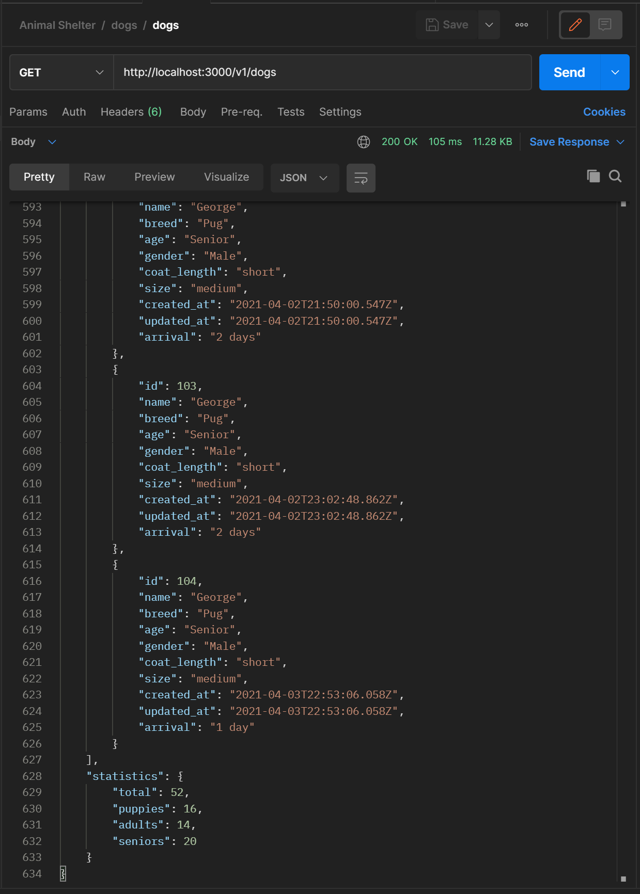
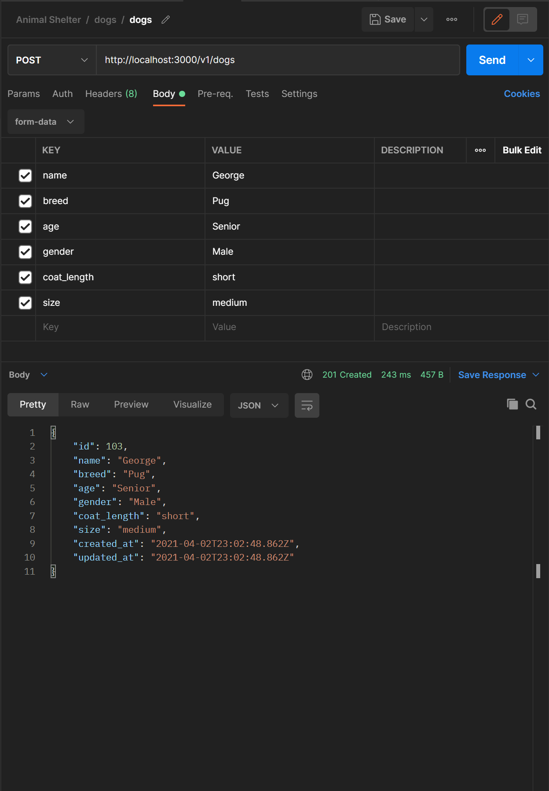
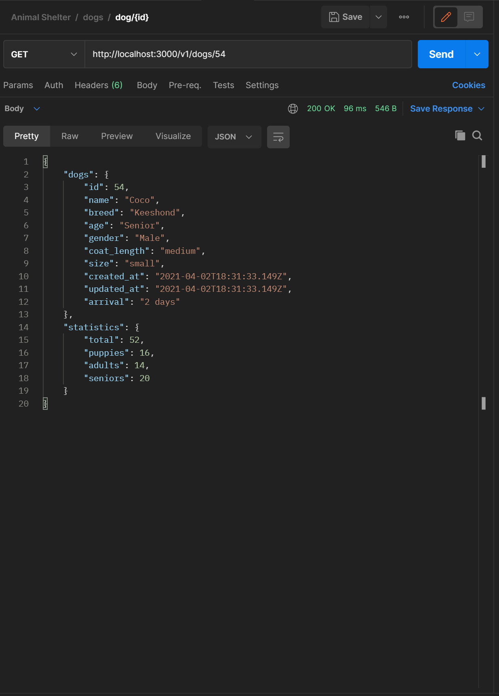
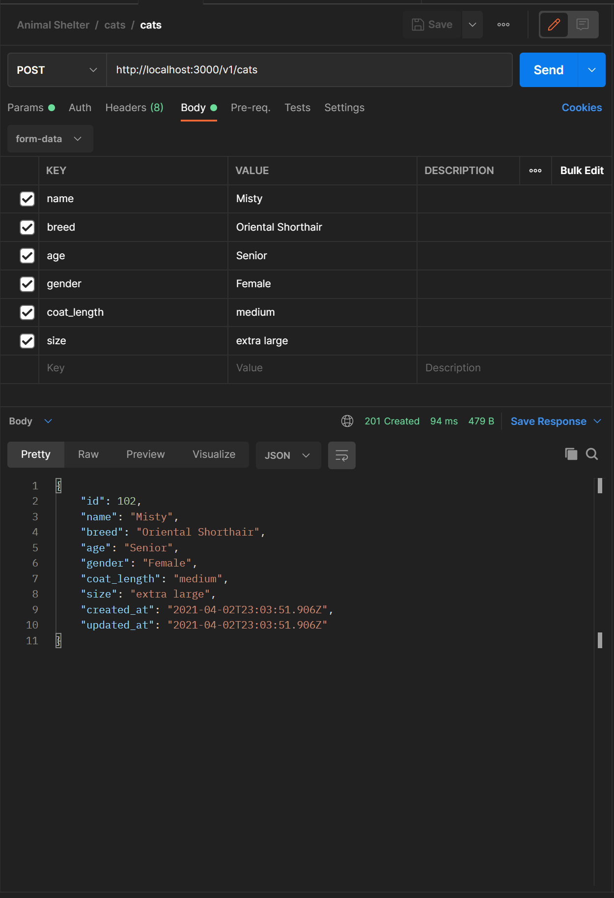
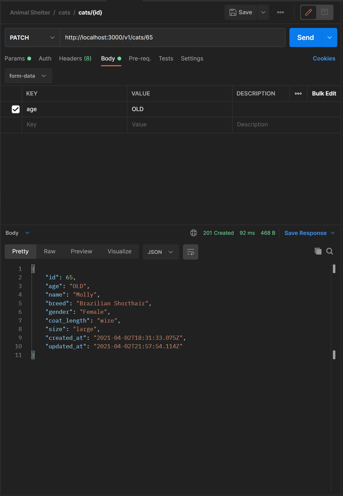

# `Animal Shelter`

### Gladstone Animal Shelter

## `Date created`
#### 4/2/2021

***
## `About this App`
- This is a week 6 Ruby on Rails Epicodus school project.
- The requirement of this API is to include a dogs and cats table.
- This API has full CRUD functionality for both tables.

***
### `Technology Used:`

* Ruby `2.6.6`
* Rails `5.2.0`
* CSS - Grid - Flex
* PostgreSQL
* Bundler
* TDD (Test-driven development)
* RSpec
* faker
* shoulda matcher
* puma
* Pry
* ByeBug
* git

## `Install & Run on your machine  :`
***
* These instructions assume you have ruby, rails, & postgres installed
* Install [Ruby and Rails](https://www.learnhowtoprogram.com/ruby-and-rails/getting-started-with-ruby/installing-ruby)
* Install [PostgreSQL](https://www.learnhowtoprogram.com/ruby-and-rails/getting-started-with-ruby/installing-postgres)
***

* Go to ( https://github.com/dcouch440/animal_shelter ).

*  Navigate to the code button on the Github website.

* Click on the code button to open the menu.

- Copy the HTTPS code by clicking the clipboard next to the link.

- Within your Bash terminal navigate to your desired location by using cd fallowed by your desired directory.

```bash
 cd Desktop
```

- Once you have chosen your desired directory use the command.

```bash
git clone https://github.com/dcouch440/animal_shelter.git
```

<div
  style="
    background-color: #d1ecf1;
    color: grey; padding: 6px;
    font-size: 9px;
    border-radius: 5px;
    border: 1px solid #d4ecf1;
    margin-bottom: 12px"
>
  <span
    style="
      font-size: 12px;
      font-weight: 600;
      color: #0c5460;"
  >
    ⓘ
  </span>
  <span
    style="
      font-size: 12px;
      font-weight: 900;
      color: #0c5460;
      margin-bottom: 24px"
  >
    Note :
  </span>
  If you have any problems make sure your HTTPS code is correct! The example above might not be the most recent HTTPS code!
</div>
  
* Then after the process is completed use the command.
```
  cd (the file name that you saved it as)
```

* now open the project with ( code is the code name for vs code )

``` bash
code .
```

For windows users navigate to the database.yml file to set your username and password.

```
Setup postgresql for rails

	📁 config > 📑 database.yml
        default: &default
          adapter: postgresql ✔️
          encoding: unicode
          pool: <%= ENV.fetch("RAILS_MAX_THREADS") { 5 } %>
          username: (username here) ✔️
          password: (password here) ✔️

```
* If you wish to keep these private you can also use a credentials password or an ENV file

* Note : we use <%= %> inside the database file because we are not within a ruby file.

### `Credentials`
* See this link to learn how to do so. ( https://www.youtube.com/watch?v=BHgvPPr2nLE )

* Start off by deleting your credentials.yml.enc file and master.key (within config folder) in order to generate another

```
  For vs code users try (within the terminal)
  EDITOR="code --wait" rails credentials:edit
```

* Within the file add then close the file to save

```
  pg_database_username: add username here
  pg_database_password: add password here
```

* Then inside the database.yml (see description above) add (or uncomment)

```
  username: <%= Rails.application.credentials.pg_database_username %>
  password: <%= Rails.application.credentials.pg_database_password %>
```

* Thats all for credentials

### `ENV`
* start by adding the gem
```
gem 'dotenv-rails'
```

* add a .env file to your main directory

```
touch .env
```

* within your file add your key and value (no quotes)

```
FIRST_VALUE_NAME='FIRST_VALUE'
SECOND_VALUE_NAME='SECOND_VALUE'
```

* Then from within your files you can call on these files as such

```
  username: <%= ENV['PG_USERNAME'] %>
  password: <%= ENV['PG_PASSWORD'] %>
```

* Thats all for .env files

* Within the main directory of the project create your databases with

```
rails db:create
```

```
rails db:migrate
```

* From here to start the server you will need to type in:

```
  rails s
```

* visit localhost:3000 to view the app
## `Routes & Api Information`

***
## `Schema`


* At any time from your console you can type

```
  rails routes
```
## `Routes`

* To bring information up about the routes. Currently the routes are
* NOTE all routes are appendages to the root route
* Start your route with http://localhost:3000
* Fallow it up with the URI pattern
* The Controller action is the MODELSController method its calling
* The Prefix is the action it uses when acting
* GET request come with statistics
```
Prefix Verb    URI Pattern     Controller#Action
  GET           /v1/dogs        v1/dogs#index
  POST          /v1/dogs        v1/dogs#create
  GET           /v1/dogs/:id    v1/dogs#show
  PATCH         /v1/dogs/:id    v1/dogs#update
  DELETE        /v1/dogs/:id    v1/dogs#destroy
  GET           /v1/cats        v1/cats#index
  POST          /v1/cats        v1/cats#create
  GET           /v1/cats/:id    v1/cats#show
  PATCH         /v1/cats/:id    v1/cats#update
  DELETE        /v1/cats/:id    v1/cats#destroy
```

The fallowing information is a listing of routes and real responses with corresponding status codes
The application displayed is called postman and can be downloaded for free from for testing
* Download Postman ( https://www.postman.com/ )
- Added recently (arrival: ) attached to all animals! This response gives you plain a plain english description of when the animal arrived!

# `Dog Paths`
### ` GET/v1/dogs { comes with statistics } `


### `POST /v1/dogs`


### ` GET /v1/dogs/:id { comes with statistics } `



### `PATCH /v1/dogs/:id `


### `DELETE /v1/dogs/:id`


## `Cat Paths`

### ` GET /v1/cats { comes with statistics } `


### `POST /v1/cats`


### ` GET /v1/cats/:id { comes with statistics } `


### `PATCH /v1/cats/:id`


### `DELETE /v1/cats/:id`


#### There are a couple codes that you might come across
* The codes shown above are specific to completing the tasks, here are the ones to look out for if things go wrong.
```
 422 UNPROCESSABLE ENTITY
 404 NOT FOUNT
```
***
The MIT License (MIT)

Copyright (c) 2021 David Couch

Permission is hereby granted, free of charge, to any person obtaining a copy of
this software and associated documentation files (the "Software"), to deal in
the Software without restriction, including without limitation the rights to
use, copy, modify, merge, publish, distribute, sublicense, and/or sell copies of
the Software, and to permit persons to whom the Software is furnished to do so,
subject to the following conditions:

The above copyright notice and this permission notice shall be included in all
copies or substantial portions of the Software.

THE SOFTWARE IS PROVIDED "AS IS", WITHOUT WARRANTY OF ANY KIND, EXPRESS OR
IMPLIED, INCLUDING BUT NOT LIMITED TO THE WARRANTIES OF MERCHANTABILITY, FITNESS
FOR A PARTICULAR PURPOSE AND NONINFRINGEMENT. IN NO EVENT SHALL THE AUTHORS OR
COPYRIGHT HOLDERS BE LIABLE FOR ANY CLAIM, DAMAGES OR OTHER LIABILITY, WHETHER
IN AN ACTION OF CONTRACT, TORT OR OTHERWISE, ARISING FROM, OUT OF OR IN
CONNECTION WITH THE SOFTWARE OR THE USE OR OTHER DEALINGS IN THE SOFTWARE.
